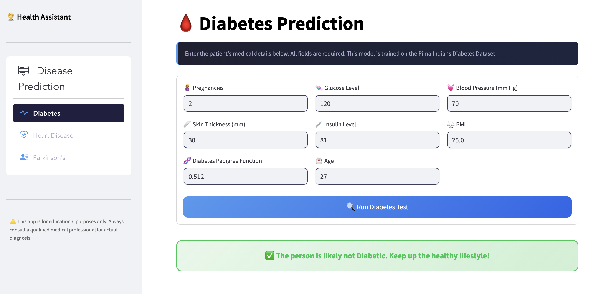
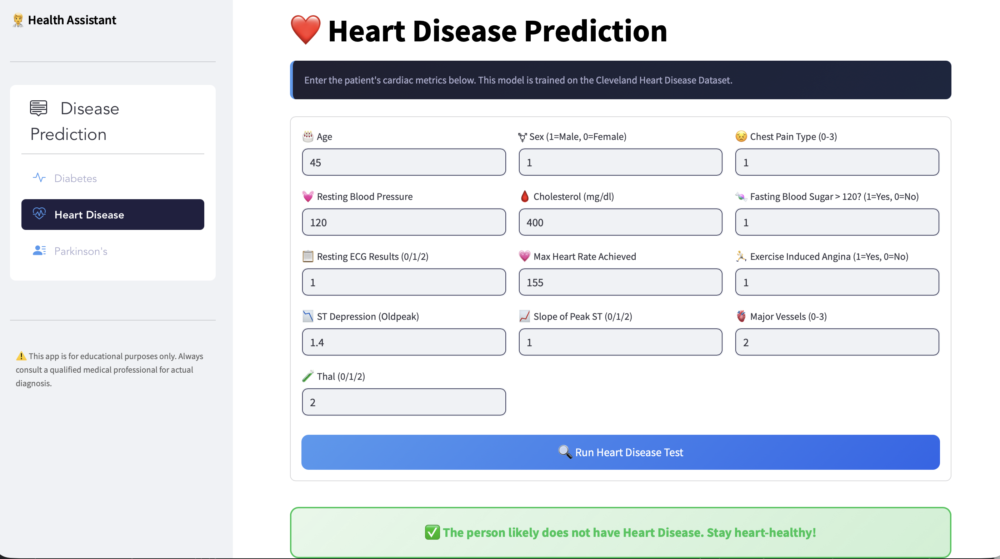

<div align="center">

# 🧑‍⚕️ HealthGuard AI
### *Early Detection. Smarter Care. Better Lives.*

[](https://streamlit.io)
[](https://python.org)
[](https://huggingface.co/spaces/AbdullahKS-Devhub/health-assistant)
[](https://scikit-learn.org)
[](https://opensource.org/licenses/MIT)

<br/>

> **Enter your vitals. Let ML assess the risk. Know before it's too late.**

<br/>

🚀 **[Try the Live Demo →](https://huggingface.co/spaces/AbdullahKS-Devhub/health-assistant)**

<br/>





</div>

---

## ✨ Features

- 🩺 **Three Disease Predictors** — Diabetes, Heart Disease, and Parkinson's under one roof
- 🧠 **Scaled ML Pipelines** — Every model paired with its own dedicated StandardScaler for accurate predictions
- 🎛️ **Guided Input Forms** — Emoji-labeled fields with placeholders and real clinical parameter names
- 🟢🔴 **Colour-Coded Results** — Instant green/red diagnosis cards with clear, human-readable messages
- ⚡ **Cached Model Loading** — `@st.cache_resource` ensures `.pkl` models load once and stay fast
- 🌐 **Zero Setup for Users** — Fully deployed on Hugging Face Spaces, runs entirely in the browser
- ⚠️ **Responsible Design** — Built-in disclaimer reminding users to consult a medical professional

---

## 🔬 Diseases Covered

| # | Disease | Algorithm | Dataset |
|---|---|---|---|
| 🩸 | **Diabetes** | Support Vector Machine (SVM) | Pima Indians Diabetes Dataset |
| ❤️ | **Heart Disease** | SVM / Logistic Regression | Cleveland Heart Disease Dataset |
| 🧠 | **Parkinson's Disease** | Support Vector Machine (SVM) | UCI Parkinson's Voice Dataset |

---

## 🛠️ Tech Stack

| Layer | Technology |
|---|---|
| **Frontend** | Streamlit + Custom CSS (dark theme, gradient cards) |
| **Navigation** | `streamlit-option-menu` |
| **ML Models** | Scikit-learn — SVM, Logistic Regression |
| **Preprocessing** | StandardScaler (per-disease scalers) |
| **Model Persistence** | Pickle (`.sav` files) |
| **Numerical Computing** | NumPy |
| **Deployment** | Hugging Face Spaces |
| **Version Control** | Git |

---

## 🧠 How It Works

```
User selects a disease from the sidebar
              ↓
Fills in clinical parameters
(glucose, blood pressure, vocal biomarkers, etc.)
              ↓
Inputs validated & converted to NumPy array
              ↓
Disease-specific StandardScaler normalises the data
              ↓
Pre-trained SVM / LR model runs prediction
              ↓
Result rendered as a colour-coded diagnosis card
       🔴 Positive          🟢 Negative
```

---

## 📥 Input Parameters

<details>
<summary>🩸 <strong>Diabetes</strong> — 8 features</summary>
<br/>

| Parameter | Description |
|---|---|
| Pregnancies | Number of times pregnant |
| Glucose Level | Plasma glucose concentration |
| Blood Pressure | Diastolic blood pressure (mm Hg) |
| Skin Thickness | Triceps skinfold thickness (mm) |
| Insulin Level | 2-hour serum insulin (mu U/ml) |
| BMI | Body mass index (kg/m²) |
| Diabetes Pedigree Function | Genetic diabetes risk score |
| Age | Age in years |

</details>

<details>
<summary>❤️ <strong>Heart Disease</strong> — 13 features</summary>
<br/>

| Parameter | Description |
|---|---|
| Age | Age in years |
| Sex | 1 = Male, 0 = Female |
| Chest Pain Type | 0–3 scale |
| Resting Blood Pressure | mm Hg |
| Cholesterol | Serum cholesterol (mg/dl) |
| Fasting Blood Sugar | > 120 mg/dl? (1/0) |
| Resting ECG Results | 0 / 1 / 2 |
| Max Heart Rate Achieved | Beats per minute |
| Exercise Induced Angina | 1 = Yes, 0 = No |
| ST Depression (Oldpeak) | Exercise vs rest |
| Slope of Peak ST | 0 / 1 / 2 |
| Major Vessels (CA) | 0–3 |
| Thal | 0 / 1 / 2 |

</details>

<details>
<summary>🧠 <strong>Parkinson's Disease</strong> — 22 vocal biomarkers</summary>
<br/>

| Parameter | Description |
|---|---|
| MDVP:Fo / Fhi / Flo (Hz) | Vocal fundamental frequency (avg / max / min) |
| MDVP:Jitter (%) & (Abs) | Frequency variation measures |
| MDVP:RAP, PPQ / Jitter:DDP | Jitter ratio measures |
| MDVP:Shimmer, Shimmer (dB) | Amplitude variation |
| Shimmer:APQ3, APQ5, APQ / DDA | Shimmer ratio measures |
| NHR / HNR | Noise-to-harmonics ratios |
| RPDE / DFA | Nonlinear dynamical complexity |
| Spread1 / Spread2 / D2 / PPE | Nonlinear frequency measures |

</details>

---

## 🚀 Run Locally

**1. Clone the repo**
```bash
git clone https://github.com/abdullahks-devhub/Multiple-Disease-Prediction-System.git
cd Multiple-Disease-Prediction-System
```

**2. Create a virtual environment**
```bash
python -m venv .venv
source .venv/bin/activate    # Mac / Linux
.venv\Scripts\activate       # Windows
```

**3. Install dependencies**
```bash
pip install -r requirements.txt
```

**4. Run the app**
```bash
streamlit run app.py
```

---

## 📁 Project Structure

```
Multiple-Disease-Prediction-System/
│
├── app.py                      # Main Streamlit application
│
├── diabetes_model.sav          # Trained SVM model — Diabetes
├── scaler.sav                  # StandardScaler — Diabetes
│
├── heart_disease_model.sav     # Trained model — Heart Disease
├── heart_scaler.sav            # StandardScaler — Heart Disease
│
├── parkinsons_model.sav        # Trained SVM model — Parkinson's
├── parkinsons_scaler.sav       # StandardScaler — Parkinson's
│
├── requirements.txt            # Python dependencies
└── README.md                   # You are here
```

---

## 📊 Datasets

| Dataset | Source | Records | Features |
|---|---|---|---|
| Pima Indians Diabetes | Kaggle / UCI | 768 | 8 |
| Cleveland Heart Disease | UCI ML Repository | 303 | 13 |
| Parkinson's Voice | UCI ML Repository | 195 | 22 |

Each dataset was preprocessed independently — features were standardised using `StandardScaler` and models were trained and exported as `.sav` pickle files for fast, dependency-free loading at runtime.

---

## ⚠️ Disclaimer

> This application is built **for educational and demonstration purposes only**.
> It is **not** a substitute for professional medical advice, diagnosis, or treatment.
> Always consult a qualified healthcare provider for any medical concerns.

---

## 🙌 Acknowledgements

- [UCI Machine Learning Repository](https://archive.ics.uci.edu/) for the Heart Disease and Parkinson's datasets
- [Kaggle](https://www.kaggle.com/) for the Pima Indians Diabetes dataset
- [Streamlit](https://streamlit.io/) for making beautiful ML apps easy to build
- [Hugging Face](https://huggingface.co/) for free ML app hosting

---

<div align="center">

Made with ❤️ by **[Abdullah Khan](https://github.com/abdullahks-devhub)**

⭐ Star this repo if you found it useful!

</div>
